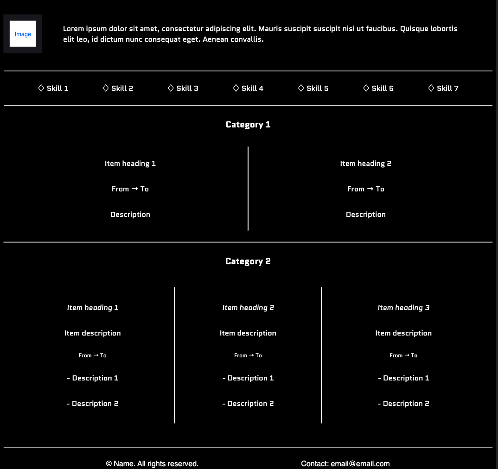

# Manzar Shahaan's Portfolio Design System Documentation

This documentation provides a clear and simplified overview of the design system used for the portfolio project. It includes colors, typography, components, and layouts, along with screenshots of mock-ups for clear communication of the design.

## **1. Color Palette**
We use a simple and clear color palette throughout the design.

- **Primary Color:** `#000000`
- **Text Color:** `#ffffff`

## **2. Typography**
- **Body Text:** `'Quantico', sans-serif`
- **Main Headers:** `'Fahkwang', sans-serif`

## **3. Components and Layout**
### Header
- **Design:** Name on the left side with navigation links on the right side seperated by a margin
- **Mock-up Screenshot:**

#### Navigation
- **Design:** White text links to Projects page and external profile links using flex display.
- **Mock-up Screenshot:**

### Content
- **Design:** Divs seperating various categories of portfolio using flex display, each seperated by horizontal rules.
- **Mock-up Screenshot:**

### Footer
- **Design:** Copyirghts and rights on left side with contact email on the right side with flex display and even-spacing.
- **Mock-up Screenshot:**

## **Conclusion**
This documentation serves as a concise reference guide for the design system used in the portfolio project, aiming to facilitate development and maintain consistency in design throughout the project.